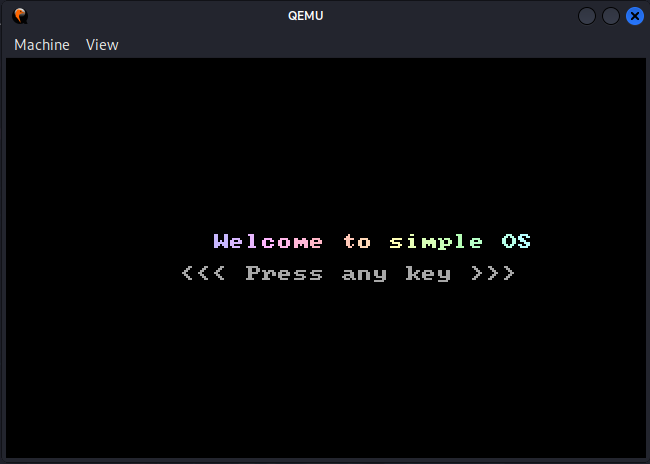
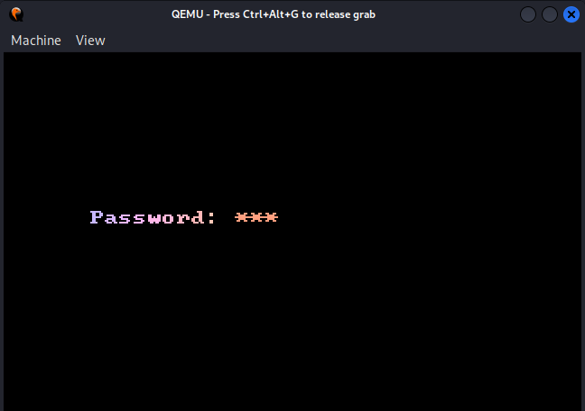
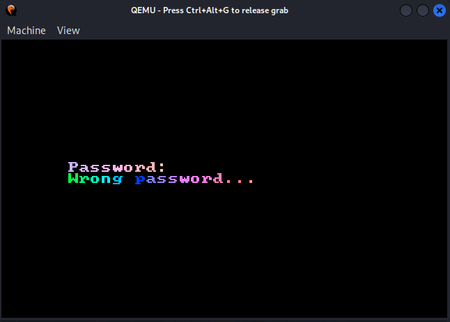
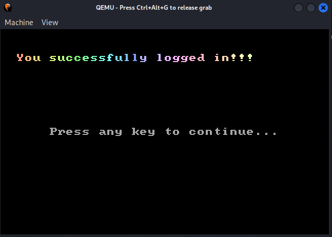

This repository provides a concept for transferring the processor to different operating modes. At the same time, related preparatory work is carried out on memory areas and, as an optimization, the A20 line of the CPU is unlocked.

---Instructions for use---

Assembly: *make*

Cleaning up the space after assembly: *make clean*

Launch of the project: *make run*

---Example of the work---

Welcome Screen

Entering the password

The correct password is *543*

Displaying information about an invalid password

Displaying information about an correct password

